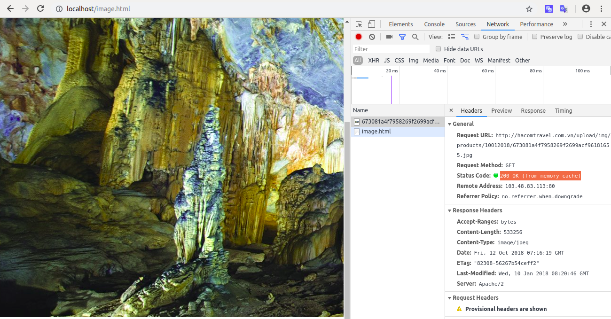

## Bài tập 2. caching 
### Vai trò của cache,các thuật toán apply cho cache(LRU,LFU)
1. _Khái niệm_
- cache là tên gọi của bộ nhớ đệm- nơi lưu trữ các dữ liệu nằm chờ các ứng dụng hay phần cứng xử lý. Mục đích của nó là tăng tốc độ xử lý.

2. _Vai trò của cache_

- Cải thiện thời gian load trang và có thể giảm tải load dữ liệu trên server và database.

<p align="center">
  
</p>
3. _Các thuật toán apply cho cache._

*  LRU (Least Recently Used):


     Với mỗi trang, ghi nhận thời điểm cuối cùng trang được truy cập, trang được chọn để thay thế sẽ là trang lâu nhất chưa được truy xuất
    <p align="center">
    
    </p>
    
    Xét ví dụ trên, ở lần truy xuất thứ 5, khi này 3 khung trang đều đầy => Tiến hành chọn trong để thay thế, trong 3 trang (0,4,1) thì trang 0 là trang lâu nhất chưa được truy xuất vì vậy thay thế trang 0 và đưa trang 5 vào khung trang. Quá trình cứ lặp lại cho đến khi kết thúc việc truy xuất.

* LFU (Least Frequently Used)

    Sử dụng bộ đếm để theo dõi tần suất truy cập vào một trang, trang nào có số lần truy nhập thấp nhất sẽ được thay thế đầu tiên

    <p align="center">
    
    </p>

    Xét ví dụ ở trên, khi trang D được truy xuất, bộ đếm sẽ đếm tần suất của trang D. Sau đó, khi trang F được truy xuất, lúc này cần phải tìm trang để thay thế. Trong các trang đó, thì trang E có tần số truy xuất lâu nhất nên sẽ được thay thế.
### Thí nghiệm: 
1. _Cài đặt nginx để phục vụ trang web tĩnh (trang web có hiển thị một bức ảnh). Tìm cách để bật module cache cho nginx (bức ảnh khi hoạt động sẽ nằm trong mem, ko phải fetch từ disk nữa)_

* Đầu tiên, ta tạo file `image.html` trong folder `/var/www/html` , để tạo một web tĩnh có chứa một bức ảnh. file   `image.html` như sau:

```
<!DOCTYPE html>
<html>

<body>
<p align="center">  </p>
</body>
```
* Thay đổi nội dung trong file  `default` trong thư mục `etc/nginx/sites-available` thành:

```
map $sent_http_content_type $expires {
    default off;
    text/html epoch;
    text/css  max;
    application/javascript max;
    ~image/ max;
}
server {
    listen 80 default_server;
    listen [::]:80 default_server;
    expires $expires;
    root /var/www/html;
    server_name _;
    location / {
        try_files $uri $uri/ =404;
    }
}

```
* Khối map trên dùng để mapping giữa loại file và thời gian nó được cached trong browser
  * `default off` : không thêm `caching control headers` vào, nó an toàn khi không có yêu cầu đặc tả cache làm việc như thế nào.
  * `text/html epoch` : là một giá trị đặc biệt chỉ định browser luôn luôn load mới dữ liệu.
  * `text/css, application/javascript ~image/`  có giá trị max: thiết lập cho browser cached với thời gian tối đa.
  * chỉ thị `expires $expires` được dùng để đưa thiết lập cache vào khối server.

* Chạy lệnh  `service nginx reload`  và verify lại việc cache của browser bằng công cụ developer tool, ta thu được kết quả dưới:

 <p align="center">
    
 </p>
