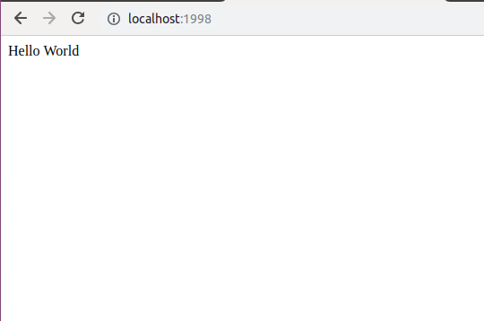
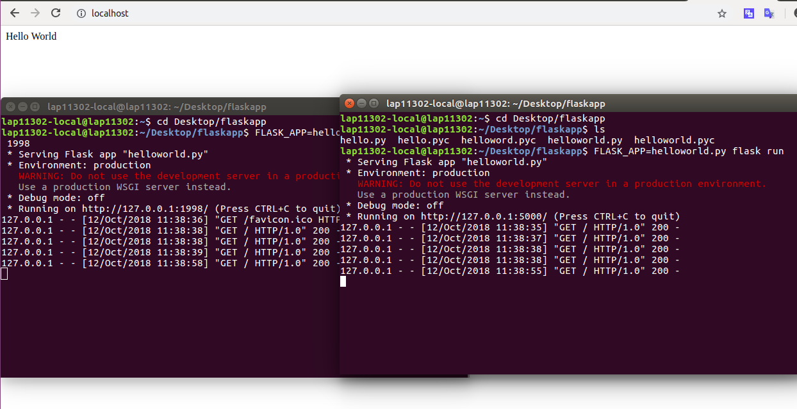

## Bài tập 1. Load Balancer 
### Khái niệm về load balancer
<p align="center">
  
</p>

Load balancer là một hệ thống đóng vai trò phân chia các request của các client đến các tài nguyên máy tính như các application servers và databases. Trong mỗi trường hợp, load balancer sẽ trả về phản hồi từ tài nguyên máy tính cho client thích hợp. Load balancer có hiệu quả :

* Ngăn chặn các request chuyển đến các server không an toàn
* Ngăn chặn các tài nguyên quá tải
* Khi một server gặp sự cố, load balancer sẽ phân phối công việc của server đó cho các server còn lại.
* Giúp loại bỏ các request lỗi.

### Kiến trúc bên trong nginx
NGINX là một web server mạnh mẽ và sử dụng kiến trúc đơn luồng, hướng sự kiện cho phép nó mở rộng tới hàng trăm nghìn kết hối đồng thời trên phần cứng hiện đại.

<p align="center">
  
</p>

Kiến trúc bên trong của NGINX như sau:

* NGINX có một master process(Thực hiện các hoạt động đặc quyền như cấu hình đọc và ràng buộc với các port) và tạo ra các process con.
* Cache loader process chạy lúc khởi động để tải bộ nhớ cache từ đĩa vào bộ nhớ, sau đó thoát. Nó được lên kế hoạch một cách cẩn thận, vì vậy nhu cầu tài nguyên của nó thấp.
* Cache manager process chạy theo định kỳ và lược bỏ một số dữ liệu ở disk cache để giữ bộ nhớ theo config
* Worker process làm tất cả công việc. Nó xử lý các kết nối mạng, đọc và ghi nội dung vào đĩa ,và giao tiếp với các upstream servers.

<p align="center">
  
</p>

### Tại sao nginx lại dùng single thread?
* Không như các web server khác tạo ra mỗi thread cho mỗi yêu cầu và blocking thread khi có yêu cầu I/O, cách thực hiện của nginx dùng cơ chế non-blocking I/O, mỗi khi có lệnh gọi tác vụ I/O, thread sẽ không bị block mà chuyển sang xử lý yêu cầu khác, khi I/O xong việc, nó sẽ gửi thông báo và thread có thể xoay vòng lại và xử lý tiếp
* Cách hiện thực này có hiệu quả hơn so với việc dùng mutithread với blocking I/O, do phần lớn thời gian xử lý một yêu cầu là xử lý tác vụ I/O, nên nếu dùng cơ chế tạo mỗi thread mới, thì phần lớn thời gian các thread này bị block, ngoài ra việc định thời các thread này thì sẽ tốn một chi phí đáng kể cho việc chuyển ngữ cảnh (lưu trạng thái, vùng nhớ..)
### Thí nghiệm
1. _Làm một web tĩnh đơn giản, viết bằng python_

Ta sử dụng flask để viết một web tĩnh đơn giản in ra "Hello World"
```
$ mkdir flaskapp && cd flaskapp
$ touch helloworld.py
```
Viết code trong file Hello.py với nội dung sau:
```
from flask import Flask
app=Flask(__name__)

@app.route("/")
def helloworld():
  return "Hello World"
```
Trong thư mục flaskapp, chạy lệnh như sau:
```
$ FLASK_APP=helloworld.py flask run
```
Mặc định web sẽ chạy trên port 5000, muốn chạy ở port khác, ví dụ 1998, ta làm như sau:
```
$ FLASK_APP=helloword.py flask run -p 1998
```
Kết quả sau khi chạy, ta được như sau:
<p align="center">
  
</p>

2. _Cho 2 web chạy trên 2 port khác nhau:_ 
  
Khi chạy ở 2 port khác nhau(port 5000 và port 1998), ta được kết quả như sau:
<p align="center">
  
</p>
<p align="center">
  
</p>

3. _Cài đặt nginx để load balancing giữa 2 port trên (verify lại bằng web browser)_

Cài đặt nginx, trong thư mục /etc/nginx/sites-available ta chỉnh sửa lại file default bằng cách thêm các dòng sau vào đầu file, đồng thời comment tất cả các dòng khác:
```
upstream {
  server localhost:5000;
  server localhost:1998;
}
server {
  listen 80;
  location /{
    proxy_pass http://localhost;
  }
}
```
Trường proxy_pass giúp cho việc thiết lập reverse-proxy, ở đây khi địa chỉ URL là http://localhost thì nó sẽ  huyển tiếp đến http://localhost:5000 hoặc http://localhost:1998, mặc định sẽ dùng giải thuật round-robin để lựa chọn host chuyển tiếp request, để thay đổi giải thuât định thời ta thêm các chỉ thị như least_conn, ip_hash, least_time,.. trong khối upstream, chi tiết tại [load_balancer_method](https://docs.nginx.com/nginx/admin-guide/load-balancer/http-load-balancer/#choosing-a-load-balancing-method).

Reload lại config nginx bằng lệnh:
```
service nginx reload
```
Chạy lại web bằng hai port 5000, 1998 như ở phần trước và dùng web browser để mở http://localhost và load lại trang nhiều lần để thấy kết quả.

<p align="center">
  
</p>