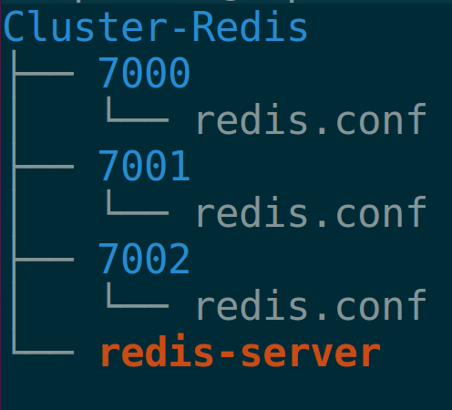
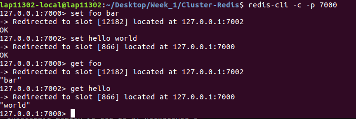

## Bài tập 3: Redis
### Khái niệm cơ bản về redis
Redis là một hệ thống lưu trữ key-value rất mạnh mẽ và phổ biến hiện nay.

Redis nổi bật với việc hỗ trợ nhiều cấu trúc dữ liệu cơ bản(hash,list,set, sorted set, string), giúp việc thao tác với dữ liệu tốt hơn các hệ thống cũ như memchached rất nhiều.

Bên cạnh lưu trữ key-value trên RAM giúp tối ưu perfomance, redis còn có cơ chế sao lưu dữ liệu trên đĩa cứng cho phép phục hồi dữ liệu khi gặp sự cố.

### Ưu điểm và nhược điểm của Redis so với DBMS

DBMS  lưu tất cả mọi thứ ở bộ nhớ thứ cấp, làm cho hoạt động đọc và ghi rất chậm. Nhưng Redis lưu trữ tất cả mọi thứ ở bộ nhớ chính , nên rất nhanh trong việc đọc và ghi dữ liệu

Bộ nhớ chính bị giới hạn(kích thước nhỏ hơn nhiều và đắt hơn thứ cấp), do đó nó không thể lưu trữ các tệp lớn hoặc dữ liệu nhị phân. Nó chỉ có thể lưu trữ những thông tin văn bản nhỏ cần được truy cập, sửa đổi và chèn vào với tốc độ rất nhanh

### Redis : Kiến trúc đơn khối
Kiến trúc Redis gồm 2 process chính : Redis client và Redis server

<p align="center">
    
</p>

Redis client và Redis server có thể ở cùng một máy tính hoặc ở hai máy tính khác nhau.

Redis server chịu trách nhiệm lưu trữ dữ liệu trong bộ nhớ. Nó xử lý tất cả các loại quản lý và tạo thành phần chính của kiến trúc. Redis client có thể là Redis console client hoặc Redis API của bất kỳ ngôn ngữ lập trình nào.

### Cấu trúc dữ liệu của Redis (Data structures)
1) String:

String là kiểu dữ liệu cơ bản nhất của Redis. Có 3 câu lệnh cơ bản với String, đó là GET, SET và DEL

Câu lệnh | Chức năng
---|---
GET | Lấy giá trị value của key
SET | Thiết lập giá trị cho key
DEL | Xóa key và giá trị tương ứng (Làm việc với tất cả các kiểu dữ liệu, không chỉ string)

2) List:

List trong Redis là linked list, lưu trữ 1 danh sách có thứ tự ( trước sau) của các string. Cách lưu trữ này giúp cho thời gian add thêm 1 phần tử vào đầu hoặc cuối list là hằng số, bất kể size của list là bao nhiêu. Lợi thế này cũng có 1 mặt trái là việc truy xuất đến phần tử theo index của linked list là lâu hơn rất nhiều so với array

Dưới đây là các câu lệnh cơ bản khi làm việc với list:

Câu lệnh | Chức năng
---|---
RPUSH | Cho thêm 1 giá trị vào phía bên phải của List
LRANGE | Lấy 1 dải giá trị của List
LINDEX | Lấy ra phần tử của List dựa theo index
LPOP | Lấy ra giá trị ở phía ngoài cùng bên trái của list và xóa giá trị đó

3) SET:

Set trong Redis khá giống với list, nhưng khác 1 điều là các phần tử trong set không được sắp xếp theo thứ tự nào cả. Tuy nhiên, Redis đã tăng performance khi làm việc với set bằng cách sử dụng 1 bảng băm (hash table) để lưu trữ các phần tử của set. Hiểu đơn giản thì mỗi item được add vào set sẽ là 1 key trong bảng băm, còn value thì không có. Việc làm này giúp theo tác truy xuất dữ liệu trên SET nhanh hơn nhiều (do tận dụng ưu thế về tốc độ tìm kiếm trên bảng băm), nhất là khi muốn đảm bảo không bị trùng lặp phần tử trong set.

4 command cơ bản khi làm việc với set là SADD, SMEMBERS, SISMEMBER, SREM. Chức năng có thể tham khảo bảng sau.

Câu lệnh | Chức năng
--- | ---
SADD | Add thêm 1 phần tử vào Set
SMEMBER | Lấy tất cả các phần tử của Set
SISMEMBER | Check xem 1 phần tử có tồn tại trong set hay không
SREM | Xoá đi 1 phần tử của set( nếu nó tồn tại)

4) HASH:

Không giống như LIST và SET lưu trữ 1 tập dữ liệu là các STRING, HASH lưu trữ tập các map của key và value. Key vẫn là string, còn value có thể là string hoặc số. Nếu là số thì chúng ta có thể làm các thao tác tăng, giảm giá trị 1 cách đơn giản. HASH được coi là mô hình thu nhỏ của Redis, khi dữ liệu được tổ chức dang key-value. Bảng sau liệt kê các câu lệnh cơ bản khi làm việc với HASH

Câu lệnh | Chức năng
---| ---
HSET | Thêm 1 cặp key-value vào hash hoặc thay đổi giá trị của key đã có.
HGET | Lấy giá trị của key trong hash có sẵn
HGETALL | Lấy tất cả các phần tử của hash
HDEL | Xóa cặp key-value ra khỏi hash(Nếu key tồn tại)

5) SORTED SET

Sorted Set (ZSET) là 1 phiên bản đầy đủ của set, khi mà phần value của item được thiết lập, và bắt buộc 1 số (float number) được gọi là score. Ở điểm này thì zset khá giống với hash khi lưu trữ 1 cặp key,value (trong zset gọi là member và score). Và vì là "sorted", nên các cặp member-score được add vào sorted set sẽ được sắp xếp theo thứ tự của các score, nếu score trùng nhau thì tiếp tục sắp xếp theo member. Ngoài ra cũng cần chú ý là không cho phép 2 phần tử khác nhau của zset có member trùng nhau. Sau đây là 4 lệnh cơ bản với zset.

Câu lệnh | Chức năng
---|----
ZADD | thêm 1 phần tử vào tập hợp score của nó
ZRANGE | Lấy ra các phần tử của tập hợp theo vị trí của chúng trong zset
ZRANGEBYSCORE | Lấy ra các phần tử của tập hợp theo phạm vi của score 
ZREM | Xóa 1 phần tử khỏi tập hợp (nếu nó tồn tại)

6) Khi nào dùng cấu trúc hyperloglog?
 
* HyperLogLogs

  Là cấu trúc dữ liệu xác suất sử dụng trong sắp xếp để đếm các phần tử phân biệt. Thông thường để đếm các phần tử này yêu cầu bộ nhớ bằng với số lượng phần tử vì chúng ta cần xết sự xuất hiện của phần tử và tránh đếm nó nhiều lần. Trong trường hợp xấu nhất Redis sử dụng 12KB.Kết quả trả về không chính xác nhất, sai số vào khoảng 0.81%. Một số command: PFADD, PFCOUNT, PF MERGE
        
* Khi nào thì sử dụng HyperLogLogs?

    Với một bộ dữ liệu cực lớn, ta muốn đếm số lượng item duy nhất trong bộ dữ liệu đó. Chẳng hạn, lượng truy cập vào 1 trang web trong tháng này có bao nhiêu địa chỉ IP duy nhất (không tính IP trùng). Yêu cầu đặt ra là phải kiểm soát được item đã gặp phải và chỉ tăng bộ đếm khi có item mới (chưa có trong bộ) được đưa vào. Việc này đòi hỏi một lượng lớn về bộ nhớ, tỷ lệ thuận với số lượng phần tử trong tập. HyperLogLogs sử dụng tính ngẫu nhiên để đưa ra số lượng phần tử duy nhất trong mỗi tập với lượng chi phí về bộ nhớ nhỏ và không đổi.
 
### Cách đặt tên keys cho phù hợp
- Một key quá dài không phải là ý tưởng tốt. Một key quá dài không chỉ tiêu tốn bộ nhớ để lưu trữ mà còn trong trường hợp tìm kiếm key trong dataset, có thể phải tiêu tốn chi phí lớn cho việc so sánh chuỗi.
- Key quá ngắn cũng không phải ý tưởng tốt, chẳng hạn u1000flw thay vì viết như vậy có thể viết user:1000:followers. key này có thể dễ đọc hơn, không gian tiêu tốn thêm là không quá lớn. Key ngắn thì không cần phải tiêu tốn nhiều bộ nhớ, cân nhắc về tên key sao cho phù hợp nhất.
- Sử dụng ":" để ngăn cách các trường, hay "-" để dùng cho từ ghép.


### Config Cluster Redis 3 Node, khác port, chạy trên cùng một máy

Chế độ Cluster chỉ thực hiện được khi có ít nhất là 3 Nodes.
- Ta sẽ cấu hình 3 Node với địa chỉ IP là localhost: 127.0.0.1, với 3 port như sau: 7001, 7002, 7003
- Tạo 3 folder 7001, 7002, 7003 với tên folder ứng với mỗi port, trong mỗi folder tạo 1 file config, config ứng với mỗi port như sau:
```sh
port 7000 => thông tin port
cluster-enabled yes => Bật chế độ cluster
cluster-config-file nodes.conf => File config cho node ở port tương ứng, file này được tạo ra bởi Redis Cluster và luôn được cập nhật khi cần thiết
cluster-node-timeout 5000
appendonly yes
```
- Tạo file config ứng với mỗi node.
- Copy file redis-server vào thư mục chính, tạo thành thư mục có cấu trúc như sau:

<p align="center">
  
</p>

- Vào từng thư mục chạy lệnh sau:

```sh
cd folder-name => 7000, 7001, 7002
../redis-server ./redis.conf
```
- Để tạo clusters mới, ta nhờ vào redis-trib, đây là một chương trình Ruby thực thi lệnh để tạo mới cluster, copy file redis-trib vào thư mục chứa redis-server.

```sh
sudo apt-get install ruby => Cài ruby nếu chưa cài
sudo gem install redis => cài redis gem để chạy redis-trib
./redis-trib.rb create 127.0.0.1:7000 127.0.0.1:7001 127.0.0.1:7002
```

- Để test chạy như sau:
<p align="center">
  
</p>